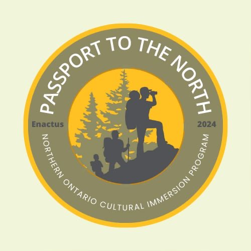

# Passport to The North

A mobile application that blends exploration, gamification, and technonology to enhance travel experiences in Northern Ontario.

# Project Overview
Passport to The North is an innovative mobile application designed to boost tourism and promote cultural heritage in Northern Ontario. This app combines interactive maps, and a reward-based system to engage users in exploring the region. By integrating technology and gamification, the app offers an immersive experience that highlights hidden gems and supports the local economy.

# Core Objective
The project aims to promote Northern Ontario's tourism and cultural heritage by motivating users to explore, complete location-based tasks, and earn achievements. By blending technology with real-world exploration, Passport to The North serves as both a guide and a game, encouraging users to discover hidden gems and contribute to the local economy.

# Technologies Used
- **Flutter**: The mobile app is developed using Flutter, a popular framework for building natively compiled applications for mobile from a single codebase. 
- **Dart**: The programming language used for writing the app's code. Dart is optimized for building mobile, desktop, and web applications.
- **Firebase**: The app uses Firebase for authentication, cloud storage, and Firestore as the database to manage user data and app content securely.
- **Firebase Cloud Messaging (FCM)**: For sending push notifications to users to keep them updated on achievements, task completions, and other notifications.
- **flutter_local_notifications**: For creating in-app notifications to alert users about various updates within the app.

# Collaborators
- **Gurnoor Kaur** (A00287615)
- **Tsunami Karki** (A00286582)
- **Keshab Pathak** (A00295473)
- **Nabin Chhetri** (A00291016)